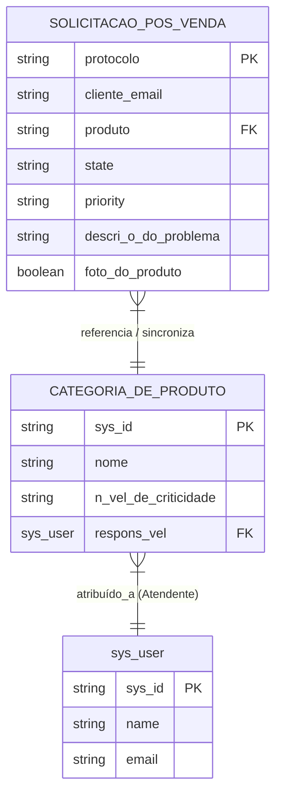

# 📊 Roteiro de Apresentação Técnica: ServiceFlow

Este documento contém a estrutura detalhada de slides para apresentar a arquitetura técnica do **ServiceFlow**, o funcionamento do agente de IA (**Sofia**) e a integração de baixo nível com a plataforma **ServiceNow**. 

Ele foi preparado com orientações visuais, diagramas explicativos em `mermaid` e notas de apresentação para orientar o orador.

---

## 🎨 Guia de Estilo Recomendado para os Slides
* **Cores**: Obsidian Dark Mode (Fundo `#09090B`, Cards `#18181B`, Texto `#FAFAFA`, Acento Roxo `#8B5CF6`).
* **Tipografia**: *Outfit* ou *Inter* (Google Fonts) para títulos limpos e modernos; *Roboto Mono* para snippets de código.
* **Visual**: Layout limpo, estilo glassmorphism (transparências sutis, bordas finas com brilho), priorizando diagramas no lugar de textos longos.

---

## 🛝 Estrutura dos Slides

### Slide 1: A Revolução do Atendimento Pós-Venda
**Subtítulo**: Como o ServiceFlow une IA Conversacional e ServiceNow de forma nativa e segura.

#### 💡 Elementos Visuais
* Lado esquerdo: Logo do ServiceFlow brilhando com efeito de gradiente roxo.
* Lado direito: Mockup PWA no celular mostrando o chat ativo com a assistente de IA.

#### 📝 Conteúdo Principal
* **O Desafio**: Formulários de suporte técnico engessados frustram clientes e geram erros operacionais de triagem.
* **A Proposta**: Substituir formulários burocráticos por uma conversa amigável guiada por IA.
* **Integração Real**: Chamados abertos na IA geram instantaneamente incidentes reais no ServiceNow.

#### 🗣️ Notas do Apresentador
> *"Hoje vamos apresentar a arquitetura do ServiceFlow. O nosso objetivo principal é remover a burocracia dos formulários tradicionais de suporte técnico. Criamos uma camada de inteligência conversacional nativa que se comunica de ponta a ponta com a maior plataforma de ITSM do mercado, o ServiceNow, preservando a segurança do dado e agilizando a triagem."*

---

### Slide 2: Arquitetura de Fluxo de Dados (Ponta a Ponta)
**Subtítulo**: O caminho da mensagem do usuário até a base de dados corporativa.

#### 💡 Elementos Visuais
* Um fluxograma de arquitetura mostrando a separação de responsabilidades (Frontend, IA, Middleware e ServiceNow).

```mermaid
graph TD
    %% Estilização do Diagrama
    classDef frontend fill:#8B5CF6,stroke:#7C3AED,stroke-width:2px,color:#fff;
    classDef middleware fill:#18181B,stroke:#3F3F46,stroke-width:2px,color:#fff;
    classDef ai fill:#D946EF,stroke:#C084FC,stroke-width:2px,color:#fff;
    classDef servicenow fill:#0284C7,stroke:#0369A1,stroke-width:2px,color:#fff;

    A["Cliente (React PWA)"] :::frontend -->|1. Entrada de Texto| B["Filtro PII (Mascara Dados)"] :::frontend
    B -->|2. Prompt Ofuscado| C["Groq AI (GPT-OSS 120B)"] :::ai
    C -->|3. Resposta Natural + JSON| B
    B -->|4. Validação & Confirmação| D["Middleware API (Node.js)"] :::middleware
    D -->|5. HTTPS/Basic Auth| E["ServiceNow (Instância Dev)"] :::servicenow
    E -->|6. Regras de Servidor: ACL & Business Rules| F[("Banco ServiceNow (Tabelas Customizadas)")] :::servicenow
```

#### 📝 Conteúdo Principal
1. **Frontend PWA**: Interface instalável, leve e adaptativa (iOS e Android).
2. **Camada de Anonimização**: Protege informações pessoais (PII) localmente antes de enviar à nuvem da IA.
3. **Middleware API**: Oculta Basic Auth e credenciais administrativas corporativas no servidor.
4. **Branding Dinâmico**: O app carrega cores, logos e nomes da IA em tempo real de System Properties do ServiceNow.

#### 🗣️ Notas do Apresentador
> *"Nesta arquitetura de fluxo de dados, a privacidade é prioridade. O navegador do cliente processa a mensagem, ofusca os dados pessoais localmente e se comunica com o Groq AI para extrair o problema. Somente após a confirmação final do cliente, o middleware do Node envia as credenciais seguras para abrir o ticket na instância real do ServiceNow, carregando antes a marca customizada do cliente de forma dinâmica."*

---

### Slide 3: A Inteligência do Agente (Sofia)
**Subtítulo**: Processamento de Linguagem Natural com privacidade garantida (PII Masking).

#### 💡 Elementos Visuais
* Comparação visual no formato "Input Original" vs "Mensagem Enviada para a IA" demonstrando o mascaramento de dados pessoais em tempo real.

#### 📝 Conteúdo Principal
* **Ofuscação Local (Mascara PII)**:
  * Regex captura e protege E-mail, Nome e Pedido no cliente.
  * A IA recebe apenas placeholders como `{nome}` e `{email}`.
* **UI Policy Conversacional**:
  * A IA exige dinamicamente campos extras (Nota Fiscal, Serial) somente se a categoria do chamado for "Garantia".
* **Payload Estruturado**:
  * Ao concluir, a IA gera um JSON estruturado oculto envelopado em tags `[DADOS_COLETADOS]` que o frontend converte em cartão de revisão.

#### 🗣️ Notas do Apresentador
> *"O agente Sofia atua como uma interface inteligente. Para obedecer às regras de privacidade da LGPD, os dados do cliente são substituídos por placeholders antes de saírem do navegador. O modelo de inteligência artificial trabalha com as variáveis genéricas e nos responde com um JSON estruturado contendo a classificação exata do problema."*

---

### Slide 4: Estrutura Interna e Segurança no ServiceNow
**Subtítulo**: Como os dados e as regras estão modelados e isolados dentro do aplicativo.

#### 💡 Elementos Visuais
* Diagrama de Modelo de Entidades e Relacionamentos simplificado das tabelas do ServiceNow.



#### 📝 Conteúdo Principal
* **Tabelas Customizadas**:
  * Chamados (`x_2014456_servicef_solicita_o_de_p_s_venda`): Estende a tabela corporativa padrão `task`.
  * Produtos (`x_2014456_servicef_categoria_de_produto`): Armazena itens de variedades, criticidades e atendentes.
* **Segurança e Controle de Relatórios (ACL `report_view`)**:
  * Criada ACL do tipo `report_view` na tabela de chamados, exigindo as roles `sf_atendente` e `sf_admin` para permitir visualizações de relatórios/widgets, prevenindo visualização de dados sensíveis por usuários externos.
  * Requer elevação especial para a role **`security_admin`** do ServiceNow para administração.

#### 🗣️ Notas do Apresentador
> *"No ServiceNow, criamos um aplicativo escopado isolado. A nossa tabela de chamados estende a tabela task padrão corporativa. Para garantir que apenas os gestores e analistas autorizados consigam visualizar os relatórios e os indicadores operacionais do dashboard, implementamos uma ACL de report_view que restringe o acesso de dados apenas aos usuários com as roles de atendente e administrador do sistema."*

---

### Slide 5: Automação Inteligente (Business Rules)
**Subtítulo**: A inteligência no servidor do ServiceNow agindo de forma pró-ativa.

#### 💡 Elementos Visuais
* Um esquema mostrando o fluxo das três Business Rules escopadas atuando nas tabelas.

```mermaid
flowchart LR
    classDef br fill:#F59E0B,stroke:#D97706,stroke-width:2px,color:#000;
    classDef table fill:#0284C7,stroke:#0369A1,stroke-width:2px,color:#fff;
    classDef action fill:#10B981,stroke:#059669,stroke-width:2px,color:#fff;

    TicketTable[("Tabela de Chamados")] :::table
    
    TicketTable -->|Antes de Inserir| BR_Sync["BR: Sincronização de Produto"] :::br
    BR_Sync -->|Se produto novo| CreateProd["Cria item na Tabela de Produtos"] :::action
    
    TicketTable -->|Ao Inserir/Atualizar| BR_Risk["BR: Triagem de Risco"] :::br
    BR_Risk -->|Palavras de risco detectadas| SetP1["Prioridade = 1 (Crítica)"] :::action
    
    TicketTable -->|Depois de Inserir/Atualizar| BR_Email["BR: Notificação Status"] :::br
    BR_Email -->|Enviar e-mail para Cliente| SendEmail["Gera registro na sys_email"] :::action
```

#### 📝 Conteúdo Principal
* **Sincronização de Produto (`before insert/update`)**:
  * Compara o produto do chamado com a tabela de produtos. Caso seja um item novo, cadastra-o automaticamente na base.
* **Triagem de Risco Automática**:
  * Monitora a descrição. Termos como *"fumaça"*, *"explosão"*, *"fogo"* ou *"bateria inchada"* forçam a prioridade do chamado para **1 (Crítica)** de forma imediata.
* **Notificação de Status (`after insert/update`)**:
  * Identifica alterações de estado (Novo, Em Andamento, Resolvido) e cria e-mails HTML na fila nativa (`sys_email`) para avisar o cliente em tempo real.

#### 🗣️ Notas do Apresentador
> *"No servidor, configuramos Business Rules dentro do escopo do ServiceFlow para rodar regras automáticas. A primeira delas sincroniza produtos não catalogados. A segunda analisa a descrição do incidente: se detectar termos críticos de segurança como fumaça ou explosão, ela eleva o ticket para Prioridade Crítica instantaneamente. Por fim, a regra de notificação gera e-mails HTML automáticos a cada atualização de status."*

---

### Slide 6: Métricas Operacionais e Dashboard Corporativo
**Subtítulo**: A visão gerencial consolidada para supervisores e diretores.

#### 💡 Elementos Visuais
* Painel moderno de relatórios do Platform Analytics Workspace integrado ao ServiceNow mostrando gráficos de pizza, barras e Single Scores.

#### 📝 Conteúdo Principal
* **Dashboard "ServiceFlow — Visão do Gestor"**:
  * **Volume por Status**: Gráfico de barras agrupado por status (`state`) dos tickets.
  * **Tipos de Chamados**: Gráfico de pizza (Troca, Reparo, Reembolso).
  * **NPS Médio**: Agregação média (`AVG`) das avaliações de satisfação.
  * **Top Produtos Reclamados**: Indicador de itens mais problemáticos.
  * **Triagem Visual**: Coluna/pizza separando chamados com foto anexada (`foto_do_produto=true`) para análise prioritária do supervisor.
* **ROI Operacional**:
  * Redução drástica do TMA (Tempo Médio de Atendimento).
  * Fila de triagem automatizada com governança ITSM nativa no ServiceNow.

#### 🗣️ Notas do Apresentador
> *"Como resultado prático para o negócio, o ServiceFlow entrega um dashboard completo de supervisão em tempo real. Os gerentes conseguem acompanhar volumetrias, os motivos mais comuns de chamados e o NPS médio dos atendimentos. A triagem visual permite que o gestor separe instantaneamente chamados com evidências fotográficas, garantindo respostas rápidas para casos documentados."*
