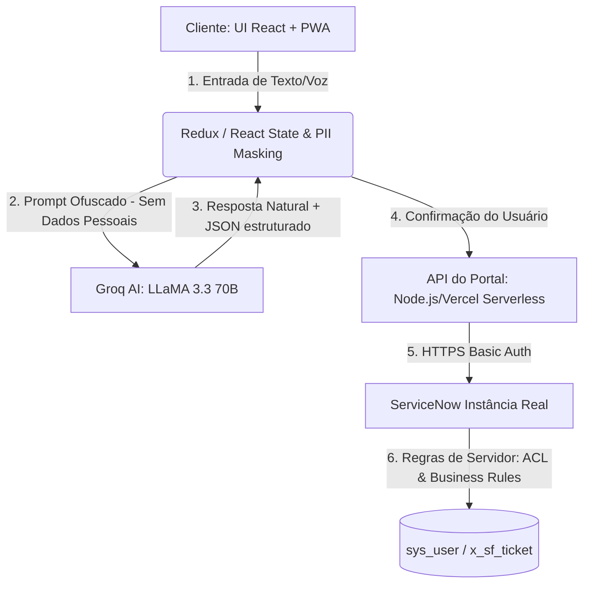

# Curso Prático de ServiceFlow: Do Mockup à Integração Real com ServiceNow

Este curso foi estruturado para desenvolvedores, arquitetos de soluções e analistas de suporte que desejam entender profundamente o funcionamento, a arquitetura e os mecanismos de integração do **ServiceFlow**. O projeto é uma plataforma premium white-label que transforma a experiência de pós-venda, substituindo formulários complexos e engessados por uma conversa fluida de Inteligência Artificial integrada diretamente ao ecossistema corporativo do **ServiceNow**.

---

## 🗺️ Índice Geral do Curso
1. [Módulo 1: Visão Geral e Arquitetura de Software](#módulo-1-visão-geral-e-arquitetura-de-software)
2. [Módulo 2: Do Mock à Integração ServiceNow Real](#módulo-2-do-mock-à-integração-servicenow-real)
3. [Módulo 3: IA Sofia e Triagem Automática (Prompt e Business Rules)](#módulo-3-ia-sofia-e-triagem-automática-prompt-e-business-rules)
4. [Módulo 4: Sistema de Notificações Ativas por E-mail](#módulo-4-sistema-de-notificações-ativas-por-e-mail)
5. [Módulo 5: Distribuição e Instalação PWA](#módulo-5-distribuição-e-instalação-pwa)
6. [Módulo 6: Dashboard de Métricas Operacionais em Tempo Real](#módulo-6-dashboard-de-métricas-operacionais-em-tempo-real)
7. [Módulo 7: Responsividade Mobile Extrema e UX](#módulo-7-responsividade-mobile-extrema-e-ux)
8. [Módulo 8: Pitch Deck Comercial (Venda e Valor de Negócio)](#módulo-8-pitch-deck-comercial-venda-e-valor-de-negócio)

---

## Módulo 1: Visão Geral e Arquitetura de Software

O ServiceFlow baseia-se em uma arquitetura moderna dividida em camadas, permitindo flexibilidade, segurança na manipulação de dados de clientes e alta performance.



### 1.1 Camada Frontend (React + Vite)
- **Roteamento Leve por Estados:** Dispensa bibliotecas pesadas e foca na performance de carregamento rápido. O arquivo `src/App.jsx` gerencia as telas principais (`landing` | `login` | `chat` | `privacy` | `terms`) usando o hook `useState` e sincronizando a posição de rolagem vertical através do método nativo `window.scrollTo`.
- **Design System "Ethereal Conduit":** Estética obsidian/glassmorphism de alto contraste com variáveis CSS globais definidas dinamicamente no `LandingPage.jsx`. Esse mecanismo permite alterar cores primárias, logos e nomes de forma White-Label em tempo de execução direto pela interface.

### 1.2 Configuração Centralizada (`src/config.js`)
Centraliza as variáveis globais de ambiente (`import.meta.env`) e provê valores de fallback para garantir resiliência caso chaves não estejam disponíveis:

```javascript
export const CONFIG = {
  brand: {
    name: 'ServiceFlow',
    aiName: 'Sofia',
    primaryColor: '#8B5CF6',
  },
  groq: {
    apiKey: import.meta.env.VITE_GROQ_API_KEY || 'YOUR_GROQ_API_KEY',
    model: 'llama-3.3-70b-versatile',
  },
  serviceNow: {
    instance: import.meta.env.VITE_SERVICENOW_INSTANCE || 'https://SUA_INSTANCIA.service-now.com',
    endpoint: '/api/serviceflow/chamados',
    user: import.meta.env.VITE_SERVICENOW_USER || 'usuario',
    password: import.meta.env.VITE_SERVICENOW_PASSWORD || 'senha',
  },
};
```

---

## Módulo 2: Do Mock à Integração ServiceNow Real

A transição de um mockup offline para um sistema real exige a criação de tabelas dedicadas, regras de segurança estritas e endpoints intermediários.

### 2.1 Modelagem de Dados no ServiceNow
A modelagem foi estruturada em um escopo próprio no ServiceNow (Studio), estendendo tabelas nativas:

1. **Clientes (`x_sf_cliente`):** Estende `sys_user` para herdar campos corporativos nativos. Adiciona o campo customizado **Turno de Preferência (`turno`)** e a **Localização (`location`)** referenciando a tabela padrão `cmn_location` (com filiais mapeadas como `EDX-PE`, `EDX-RJ` e `EDX-MG`).
2. **Atendentes (`x_sf_atendente`):** Estende `sys_user`. Adiciona campos como **Matrícula (`registration_number`)** e datas de contratação e demissão.
3. **Avaliações NPS (`x_sf_nps`):** Tabela Muitos-para-Muitos (M2M) associando registros de Clientes e Serviços com avaliações numéricas de 1 a 5 e comentários adicionais.
4. **Chamados de Pós-Venda:** Tabela customizada no ServiceNow (`x_2014456_servicef_solicita_o_de_p_s_venda`) usada para registrar e processar as solicitações criadas pela IA.

### 2.2 Endpoint Customizado (Scripted REST API)
Para expor permissões de segurança e evitar consultas inseguras diretas de tabelas do sistema, criamos uma Scripted REST API no ServiceNow (`API ID: sf_portal`):

- **GET `/permissions`:** Captura as permissões dinâmicas do usuário atual aplicando o método server-side `canRead()`, `canWrite()`, `canCreate()` e `canDelete()` na tabela de chamados:

```javascript
(function process(request, response) {
    var tableName = request.queryParams.table ? request.queryParams.table[0] : 'x_sf_ticket';
    var gr = new GlideRecord(tableName);
    
    var result = {
        canRead: gr.canRead(),
        canWrite: gr.canWrite(),
        canCreate: gr.canCreate(),
        canDelete: gr.canDelete(),
        roles: gs.getUser().getUserRoles().toArray()
    };
    
    response.setStatus(200);
    response.setBody(result);
})(request, response);
```

### 2.3 Middleware de Portal (Rotas de API no Frontend)
Para evitar o vazamento das credenciais administrativas (`admin` / `password` Basic Auth) e permitir chamadas limpas, o portal utiliza endpoints Node.js na pasta `/api/`:

* **`api/permissoes.js`**: Pede ao ServiceNow as ACLs e as Roles com base no e-mail do usuário autenticado. Retorna se o usuário logado possui a role `sf_cliente`, `sf_atendente` ou `sf_admin`.
* **`api/meus_chamados.js`**: Retorna a lista de chamados. Se for agente (`sf_atendente` ou `sf_admin`), retorna a fila geral de tickets para gerenciamento. Se for cliente (`sf_cliente`), filtra rigidamente e exibe apenas os seus próprios chamados cadastrados.
* **`api/chamados.js`**: Trata a criação (`POST` direto para a API do ServiceNow) e a atualização de status (`PUT` enviado pelo analista para marcar o chamado como *Em Andamento* ou *Resolvido*).
* **`api/nps.js`**: Envia a pontuação de satisfação do usuário através de um verbo `PATCH` apontado para a API de chamados.

---

## Módulo 3: IA Sofia e Triagem Automática (Prompt e Business Rules)

A inteligência da Sofia está em guiar o usuário de forma amigável, extrair dados estruturados sem impor formulários e atuar junto com o servidor para priorizar os chamados.

### 3.1 Engenharia de Prompt e Ofuscação de PII (Privacidade)
Para obedecer às regras de privacidade (LGPD), o sistema executa a **ofuscação de PII (Personally Identifiable Information)** no lado do cliente (`ChatPage.jsx`):

1. **Extração de Variáveis Locais:** Antes do texto do usuário ser enviado à nuvem do Groq, funções Javascript e expressões regulares capturam dados pessoais e os salvam localmente em `clientVars`:
   - E-mail (`/^[^\s@]+@[^\s@]+\.[^\s@]+$/`).
   - Nome completo ("Meu nome é Pedro Santos").
   - Pedido (`/#\d+/`).
2. **Substituição por Placeholders:** O texto enviado ao Groq é reescrito substituindo os dados reais por `{nome}`, `{email}` e `{numero_pedido}`.
3. **Comportamento da IA:** A instrução do sistema (System Prompt) orienta a IA a trabalhar com esses placeholders. Se a IA vir a mensagem contendo `{nome}`, ela assume que o dado foi validado e prossegue.
4. **Extração dos Dados Coletados:** Quando a IA detecta que coletou todas as informações necessárias, ela gera um JSON estruturado envelopado pela tag `[DADOS_COLETADOS]`:

```json
[DADOS_COLETADOS]
{
  "nome": "{nome}",
  "email": "{email}",
  "numero_pedido": "{numero_pedido}",
  "produto": "iPhone 15 Pro Max",
  "tipo": "Garantia",
  "descricao": "Bateria estufou e solta fumaça",
  "fotos_enviadas": "sim",
  "numero_serie": "SN-IPH159382",
  "nota_fiscal": "NF-9839"
}
[/DADOS_COLETADOS]
```

O frontend remove esse bloco visualmente via `cleanMessageText` e monta um cartão nativo (`confirm-card`) de revisão, onde o usuário clica para confirmar o envio final.

### 3.2 Triagem Automática de Prioridades e Categoria
- **UI Policy de Conversa (Frontend):** A IA atua como uma UI Policy conversacional. Se o cliente define o `tipo` como "Garantia", a Sofia exige de forma obrigatória o **Número de Série** e a **Nota Fiscal**. Caso contrário, prossegue sem solicitá-los.
- **Triagem Automática por Business Rule (Servidor ServiceNow):** No servidor, uma Business Rule configurada na tabela `x_2014456_servicef_solicita_o_de_p_s_venda` atua de forma proativa. Quando o chamado é inserido ou modificado, o script varre o campo `descri_o_do_problema`:

```javascript
(function executeRule(current, previous /*null when async*/) {
    var desc = (current.descri_o_do_problema || '').toLowerCase();
    
    // Lista de palavras de alto risco
    var alertKeywords = ['explosão', 'fumaça', 'fogo', 'explodiu', 'queimou', 'bateria inchada', 'risco'];
    var isEmergency = false;
    
    for (var i = 0; i < alertKeywords.length; i++) {
        if (desc.indexOf(alertKeywords[i]) > -1) {
            isEmergency = true;
            break;
        }
    }
    
    if (isEmergency) {
        current.urgency = '1'; // Alta Urgência
        current.impact = '1';  // Alto Impacto
        current.priority = '1'; // Prioridade Crítica
    }
})(current, previous);
```

---

## Módulo 4: Sistema de Notificações Ativas por E-mail

A plataforma de ITSM do ServiceNow gerencia as notificações nativas via e-mail configuradas em `System Notification > Email > Notifications`:

1. **Notificação de Atribuição de Chamado (`x_sf_ticket`):**
   - **Gatilho:** Atualização do registro quando o campo Atendente (`assigned_to`) é preenchido.
   - **Destinatário:** O e-mail do analista responsável.
   - **Assunto:** `[ServiceFlow] Novo chamado atribuído: ${number}`
   - **Conteúdo HTML:** Detalhes da solicitação, SLA e link de acesso rápido ao chamado no ServiceNow.
2. **Notificação de NPS Registrado (`x_sf_nps`):**
   - **Gatilho:** Inserção de uma avaliação na tabela NPS.
   - **Destinatário:** O e-mail do Cliente associado.
   - **Assunto:** `Agradecemos sua nota ${rating} - Atendimento ServiceFlow`
   - **Conteúdo HTML:** Envio do resumo do feedback e canal de contato direto com o supervisor.

---

## Módulo 5: Distribuição e Instalação PWA

O ServiceFlow é totalmente compatível com a arquitetura PWA (Progressive Web App), convertendo-se em uma aplicação instalável em celulares e desktops sem a necessidade de lojas de aplicativos (App Store / Google Play).

### 5.1 Fluxo de Instalação no Android / Chrome Desktop
O navegador escuta o evento de instalação `beforeinstallprompt` e o armazena em estado no `App.jsx`. Um banner nativo de instalação é exibido caso o usuário ainda não tenha o aplicativo na tela inicial:

```javascript
const [deferredPrompt, setDeferredPrompt] = useState(null);
const [showInstallPrompt, setShowInstallPrompt] = useState(false);

useEffect(() => {
  const handleBeforeInstallPrompt = (e) => {
    e.preventDefault();
    setDeferredPrompt(e);
    // Exibe o banner apenas se não foi dispensado anteriormente
    const dismissed = sessionStorage.getItem('sf_pwa_dismissed');
    if (!dismissed) {
      setShowInstallPrompt(true);
    }
  };
  window.addEventListener('beforeinstallprompt', handleBeforeInstallPrompt);
  return () => window.removeEventListener('beforeinstallprompt', handleBeforeInstallPrompt);
}, []);

const handleInstallPWA = async () => {
  if (!deferredPrompt) return;
  deferredPrompt.prompt();
  const { outcome } = await deferredPrompt.userChoice;
  console.log(`PWA choice: ${outcome}`);
  setDeferredPrompt(null);
  setShowInstallPrompt(false);
};
```

### 5.2 Fluxo de Instalação no iOS (Safari)
Dispositivos da Apple não oferecem suporte automático ao evento nativo do Chrome. O `App.jsx` realiza a detecção de ambiente e orienta o usuário de forma clara:

```javascript
useEffect(() => {
  const isIOS = /iPhone|iPad|iPod/i.test(navigator.userAgent) || 
                (navigator.userAgent.includes("Mac") && "ontouchend" in document);
  const isStandalone = window.navigator.standalone === true || 
                       window.matchMedia('(display-mode: standalone)').matches;
  
  if (isIOS && !isStandalone) {
    const dismissed = sessionStorage.getItem('sf_pwa_dismissed_ios');
    if (!dismissed) {
      setTimeout(() => setShowIOSPrompt(true), 3000);
    }
  }
}, []);
```

- **Banner iOS:** Informa ao usuário para clicar no botão de compartilhar (ícone `ios_share`) na barra do navegador Safari e selecionar **Adicionar à Tela de Início** para concluir a instalação do PWA.

---

## Módulo 6: Dashboard de Métricas Operacionais em Tempo Real

A página principal de supervisão administrativa (`activeTab === 'dashboard'`) calcula e exibe métricas reais do ServiceNow atualizadas por requisições na fila de chamados:

| Métrica | Cálculo no Frontend | Descrição / Objetivo Comercial |
| :--- | :--- | :--- |
| **SLA (%)** | `((metSlaCount / totalSlaCount) * 100)` | Percentual de chamados resolvidos dentro do prazo estipulado por contrato. |
| **TMA** | `(totalTmaMinutes / tmaCount)` | Tempo Médio de Atendimento calculado dinamicamente em minutos/horas desde a criação do ticket. |
| **CSAT / NPS** | `(npsSum / npsCount)` | Satisfação média baseada nas avaliações enviadas pelos clientes (1.0 a 5.0). |
| **Fila Ativa** | `queueTickets.length` | O número total de chamados atualmente sob triagem ou resolução. |

O painel exibe também a distribuição de chamados através de uma barra de progresso horizontal para as três filiais regionais ativas no ServiceNow: **EDX-RJ (Rio de Janeiro)**, **EDX-PE (Recife)** e **EDX-MG (Belo Horizonte)**.

---

## Módulo 7: Responsividade Mobile Extrema e UX

O ServiceFlow passou por correções minuciosas no CSS (`MyCasesPage.css` e `ChatPage.css`) para garantir responsividade total em telas de dispositivos móveis.

### 7.1 Suporte a Entalhes e safe-area-inset
Dispositivos com notch (iPhones modernos e aparelhos Android) sofrem com elementos cobertos pela barra de status do sistema. O padding superior do cabeçalho de chamados foi ajustado usando as variáveis de ambiente CSS:

```css
@media (max-width: 640px) {
  .mycases-header {
    /* Soma a margem padrão ao valor dinâmico do topo fornecido pelo aparelho */
    padding: calc(1rem + env(safe-area-inset-top)) 1.25rem 1rem 1.25rem;
  }
  .mycases-list {
    /* Adiciona padding no final para garantir que o scroll limpe a barra flutuante do PWA */
    padding: 1rem 1rem calc(80px + env(safe-area-inset-bottom));
  }
}
```

### 7.2 Botões Colapsáveis Dinâmicos
Em telas menores que 480px de largura, textos de ações primárias extensas como "Novo Chamado" podem quebrar o layout lateral. O CSS oculta o texto mantendo apenas o ícone centralizado em um formato circular (Floating Action Button):

```css
@media (max-width: 480px) {
  .mycases-btn-new .btn-text {
    display: none; /* Oculta o texto */
  }
  .mycases-btn-new {
    padding: 0.625rem;
    border-radius: 50%;
    width: 2.5rem;
    height: 2.5rem;
    min-width: 2.5rem;
    justify-content: center;
    flex-shrink: 0;
  }
}
```

---

## Módulo 8: Pitch Deck Comercial (Venda e Valor de Negócio)

Esta seção resume os argumentos de venda e diferenciais mercadológicos do ServiceFlow, servindo como guia rápido para apresentações institucionais.

### 🎯 1. O Problema
- **Suporte Burocrático:** Formulários de abertura de suporte técnico convencionais possuem muitos campos, gerando desistências e frustrações nos usuários.
- **Custos Operacionais Altos (TMA):** Triagem manual ineficiente de e-mails e chamados exige analistas dedicados apenas a classificar a gravidade dos incidentes.
- **Falta de Integração:** Ferramentas de chat convencionais não se integram de verdade aos sistemas corporativos (como ServiceNow), exigindo digitação dupla.

### 💡 2. A Solução (ServiceFlow)
- **IA Sofia Integrada:** A assistente virtual coleta dados em tom conversacional, reduzindo a fricção e gerando o JSON de chamados de forma natural.
- **Conexão ServiceNow em Tempo Real:** Sem integrações manuais ou planilhas. Em 2 segundos, o chamado real é criado no ServiceNow e o protocolo é exibido.
- **Triagem Automatizada por Nível de Risco:** IA pré-classifica e a Business Rule do ServiceNow aumenta a urgência e impacto de chamados com palavras de risco (fumaça, fogo, explosão).

### 🏆 3. Principais Diferenciais Competitivos
- **Privacidade nativa (PII Masking):** O frontend mascara dados sensíveis antes de enviá-los às APIs de terceiros (como Groq/LLaMA), protegendo informações pessoais de vazamentos.
- **Dashboard Integrado de SLA e TMA:** Supervisores acompanham em tempo real a performance operacional sem sair da interface.
- **Pronto para PWA e Dispositivos Móveis:** Experiência de aplicativo nativo no celular, sem downloads pesados, consumindo pouca bateria e rodando offline.

### 📈 4. O Retorno sobre o Investimento (ROI)
- **Redução do TMA (Tempo Médio de Atendimento):** O tempo para reportar e classificar o problem cai de minutos para menos de 60 segundos.
- **Aumento do NPS / CSAT:** Clientes classificam o suporte de forma mais positiva devido à rapidez e ausência de campos burocráticos.
- **Eficiência Operacional:** Triagem automática evita erros humanos de priorização na fila de suporte, priorizando incidentes críticos.
